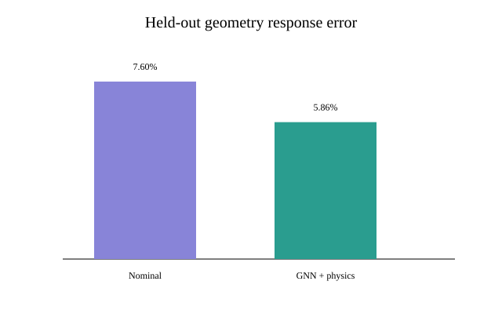

# 实验二十一：COMSOL 教师驱动的匝级 GNN＋物理反演最小闭环

## 1. 实验目的

本实验回答一个很窄但关键的问题：在尚未具备实机逐匝测量数据时，能否先用参数化 COMSOL 匝级矩阵构造可信的仿真教师，并跑通

\[
\text{COMSOL 匝级矩阵}\rightarrow
\text{DAB 多窗口端口观测}\rightarrow
\text{低维耦合参数辨识}\rightarrow
\text{GNN 初值＋物理求解器}
\]

的最小链路。它不是实机结论，也不声称已经辨识每个 \(C_{ij}\) 和 \(M_{ij}\)。

## 2. COMSOL 教师数据

采用 4 匝原边＋4 匝副边轴对称模型，共生成 12 个独立几何：原副边径向间隙为 1.0、1.5、2.0 mm；同绕组匝间距为 0.15、0.25 mm；副边轴向错位为 0、0.625 mm。

每个几何执行 8 次独立端子电荷求解得到 Maxwell 电容矩阵 \(\mathbf C\)，执行 36 次磁能组合求解得到互感矩阵 \(\mathbf L\)。原 EXP-020 几何坐标是硬编码的，因此本实验逐个改写 8 个导体矩形的位置并重建几何与网格，而不是只修改无效的全局参数名。

质量检查结果：12 组矩阵全部有限；最大电容非对称残差为 \(1.13\times10^{-26}\,\mathrm F\)，电感矩阵非对称残差为 0。跨绕组总电容与原副边间隙的相关系数为 \(-0.977\)，相邻匝电容与匝间距的相关系数为 \(-0.986\)，方向符合场论预期。

## 3. 低维物理参数化

端口观测不可能唯一恢复全部匝级矩阵元素。因此只辨识五个对数修正坐标：

\[
\boldsymbol\theta=[\theta_{IT},\theta_{WW},\theta_{TC},\theta_m,\theta_\ell]^T .
\]

其中 IT、WW、TC 分别控制相邻匝、跨绕组和对参考导体的电容；\(\theta_m\) 与 \(\theta_\ell\) 控制主磁通模态和漏磁子空间。电感矩阵按

\[
\mathbf L(\theta)=e^{\theta_m}\lambda_1\mathbf u_1\mathbf u_1^T+
e^{\theta_\ell}\sum_{q=2}^{8}\lambda_q\mathbf u_q\mathbf u_q^T
\]

构造；电容矩阵由正互电容与参考电容重新盖章，因此两者保持物理合法。

## 4. 多窗口端口观测

对六个自然谐波频点，构造四组 DAB 风格电压方向：相移角为 \(8^\circ,17^\circ,29^\circ,41^\circ\)，电压比分别为 0.86、0.96、1.05、1.14。由

\[
\mathbf I_k=\mathbf Y_k\mathbf V_k+\mathbf n_k
\]

生成带 34--52 dB 随机信噪比的电流，再用正规方程重构两端口导纳。这模拟“多运行窗口恢复端口矩阵”，不是向网络提供无噪声真值。

内部物理求解采用

\[
\mathbf Y_n(\omega)=\mathbf A(\mathbf R+j\omega\mathbf L)^{-1}\mathbf A^T+j\omega\mathbf C,
\]

再通过 Kron 消元得到两端口 \(\mathbf Y_p\)。

## 5. 网络结构与训练

网络是 73,925 参数的轻量 edge-centric GNN。8 个节点分别表示 8 匝；全有向匝对边包含相对坐标、距离、同绕组/相邻关系以及标称 \(C_{ij},L_{ij}\)。网络执行三轮边消息传递，把多窗口复导纳的幅相编码与图级表示融合，输出五个有界对数修正量。

损失为参数监督与可微物理残差的组合：

\[
\mathcal L=\|\widehat{\boldsymbol\theta}-\boldsymbol\theta\|_2^2
+0.02\,\|\mathbf Y_p(\widehat{\boldsymbol\theta})-widehat{\mathbf Y}_{meas}\|_2^2.
\]

数据按几何隔离：8 个 COMSOL 几何训练、2 个验证、2 个完全未见几何测试；每个几何 60 个扰动状态。训练使用 RTX 5070、PyTorch 2.11.0+cu128，800 个 epoch，约 261 s。

## 6. 结果

| 方法 | 五参数 MAE（对数尺度） | 端口响应相对误差 | 物理迭代总耗时 |
|---|---:|---:|---:|
| 不更新标称矩阵 | -- | 7.603% | 0 |
| GNN 直接反演 | 0.07569 | 5.864% | 0 |
| 纯物理反演（零修正初值） | 0.04939 | 1.0081% | 3.816 s |
| GNN 初值＋物理反演 | 0.04939 | 1.0080% | 3.174 s |

GNN 直接反演使响应误差相对降低 22.87%，说明端口频谱与匝级图中存在可学习信息。然而，物理优化明显更准确；GNN 初值没有改善最终参数精度，只把本轮物理优化时间降低约 16.8%。因此当前结果不能证明 GNN 已具有不可替代的精度优势。

## 7. 结论与边界

实验成功之处是：首次用真实 COMSOL 匝级 \(\mathbf C/\mathbf L\) 教师替代手工合成矩阵，并完整跑通 CUDA GNN、端口多窗口观测和物理合法的低维反演。

实验没有证明实机可用、跨磁芯/绕组结构泛化、每条耦合边可辨识，或 GNN 比物理最小二乘更准确。当前 GNN 的主要价值只是快速给出初值；在这个小问题上，纯物理求解器已经很强。

下一实验不应盲目增大网络，而应加入 forward/inverse 模型失配（频变电阻、探头增益相位、接地电容、死区和器件寄生），检查 GNN 是否能在物理模型不完备时稳定降低偏差。同时应至少把 COMSOL 几何扩充到 30--50 个，再讨论跨结构泛化。
