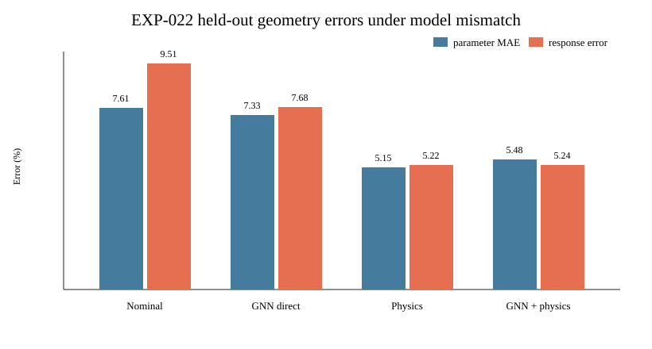

# 实验二十二：前向—反演模型失配下的鲁棒匝级参数辨识

## 1. 为什么进行该实验

EXP-021 中，数据生成模型与反演模型基本同构，纯物理优化最终优于 GNN。EXP-022 刻意令

\[
\mathcal F_{forward}\neq\mathcal F_{inverse},
\]

用于回答：当在线物理模型没有覆盖全部寄生和测量链路时，GNN 是否能够学习剩余误差并改善五维匝级参数辨识。

## 2. 已知的反演模型

反演端仍只知道 EXP-021 的五维修正：

\[
\boldsymbol\theta=[\theta_{IT},\theta_{WW},\theta_{TC},\theta_m,\theta_\ell]^T,
\]

并用固定电阻、COMSOL 标称 \(\mathbf C_0,\mathbf L_0\) 和 Kron 消元计算两端口响应。

## 3. 反演器未知的前向非理想因素

复杂前向模型额外加入：

1. 25--85 ℃ 温度相关铜阻；
2. \(R(f)=R_T[1+\alpha\sqrt{f/100\,\mathrm{kHz}}]\) 的频变电阻；
3. 原副边各 0--4 pF 的非对称对地杂散电容；
4. 四条电压/电流测量通道各自 ±2% 增益误差；
5. 各通道 ±45 ns 时间偏移；
6. 34--50 dB 电流测量信噪比。

观测频率扩展到 20 kHz--1 MHz，并继续用四个 DAB 风格电压方向恢复两端口导纳。

## 4. 数据和网络

仍使用 EXP-021 的 12 个 COMSOL 几何，每个几何生成 80 个参数/非理想组合。采用严格几何隔离：8 个训练、2 个验证、2 个测试。网络沿用轻量 edge-centric GNN，以匝级图及带失真的多频端口导纳为输入。

由于反演物理有意不完整，训练中的物理残差权重由 0.02 降为 0.003，避免错误物理模型压制监督信号。测试比较：不更新标称模型、GNN 直接反演、错误模型下的纯物理优化、以 GNN 为正则中心的混合优化。

## 5. 结果

| 方法 | 五参数 MAE | 简化模型对观测响应误差 | 说明 |
|---|---:|---:|---|
| 标称模型 | 0.07608 | 9.506% | 不作在线更新 |
| GNN 直接反演 | 0.07325 | 7.679% | 小幅优于标称模型 |
| 失配物理反演 | **0.05147** | **5.221%** | 参数精度最佳 |
| GNN 正则化物理反演 | 0.05478 | 5.242% | 未超过纯物理方法 |

训练使用 RTX 5070、PyTorch 2.11.0+cu128，700 epoch，约 335 s。

## 6. 关键解释

结果没有证明当前 GNN 能解决模型失配。原因并非网络不够大，而是许多非理想变量没有被独立观测。例如探头增益误差、额外对地电容和真实 \(\theta_{TC}\) 都可能造成相似的端口变化；从同一组端口导纳出发，它们存在混淆。网络只能学习训练分布的平均修正，不能凭空恢复样本独有但未观测的测量链路状态。

纯物理优化虽然使用错误模型，仍能通过五个自由度逼近端口曲线，因此响应误差下降；但这不保证其内部参数完全真实。5.15% 的参数 MAE 与 5.22% 的响应误差体现了“端口拟合较好不等于内部参数正确”。

## 7. 对下一步的约束

下一步不应继续简单扩大 GNN。应先做可观测性消融：分别加入可获得的温度、测量链路校准量和对地电流/第三端口观测，判断哪类附加信息真正解除混淆。若加入校准信息后 GNN 明显优于纯物理反演，才有理由进入更大 COMSOL 数据集和实机迁移；若仍无优势，则保留物理优化，放弃把 GNN 强行作为主方法。

本实验仍是仿真到仿真的可行性/否证实验，不代表真实 DAB 在线精度。
